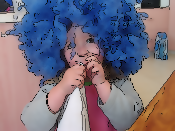
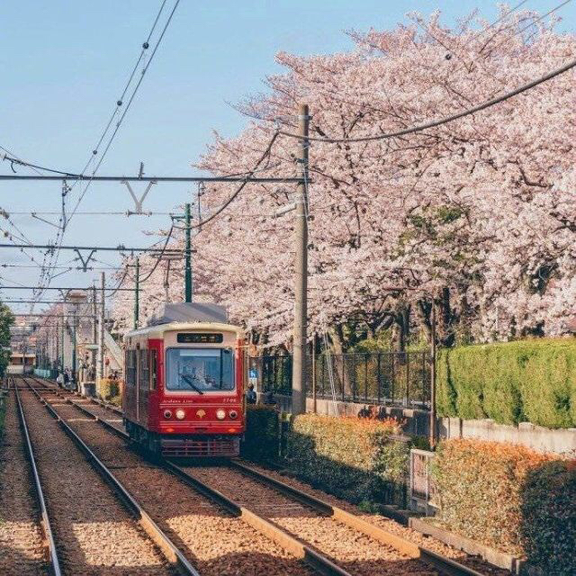
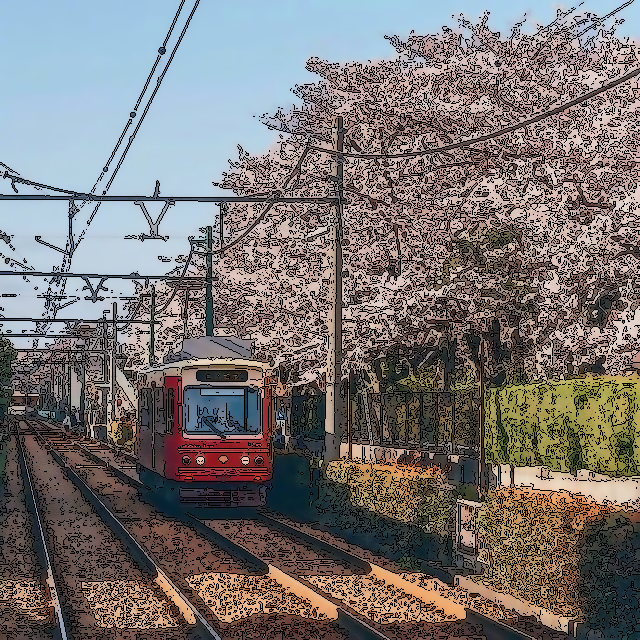
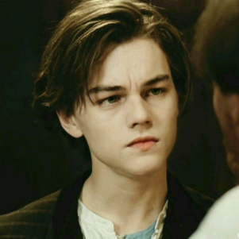
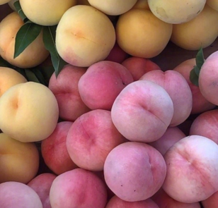
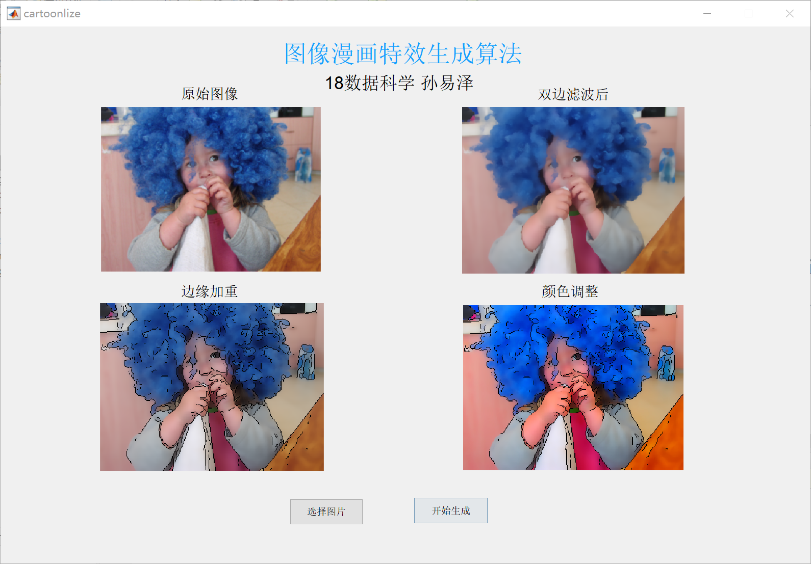

<table>
    <tr>
        <td ><center> </center></td>
        <td ><center> </center></td>
    </tr>
    <tr>
        <td><center>原始图片</center></td>
        <td><center>漫画风格生成后</center> </td>
    </tr>
</table>


# 图像漫画风格生成算法

> 山东大学（威海）
> 18级 数据科学与人工智能 孙易泽

## 项目简介

本项目通过对原有图片进行处理后，生成具有漫画风格的图片。

具体处理方法如下：先将原有图像进行**双边滤波**，在保留边缘特征的同时对图像进行模糊处理；接着通过**Sobel算子**对图像进行**边缘检测**，对图片边缘区域进行加重处理；最后再增强图像**颜色饱和度**，达到漫画的效果。

本项目使用Matlab语言进行编程，有关项目更多信息和完整代码，可以查看文章结尾附录，或个人github：

+ https://github.com/Sun-Yize-SDUWH/Photo-Cartoonization

*关键词：图像滤波 边缘提取*

## 图片分析

要想将图片处理成漫画风格，首先要了解漫画风格构图特点。漫画相比于真实图片，主要存在以下几点差异：

+ 相比于真实图片，漫画细节较少
+ 漫画色彩相对真实图片更为鲜明
+ 漫画在物品边缘处存在线条勾勒

接下来我们将对于以上三点，逐步对图片进行效果处理。

## 图像滤波

在图像滤波过程中，我们要使图片细节变少，进行模糊化处理，同时保留图像一定的边缘特征。最为常见的模糊化处理图像的算法为高斯算法，但是高斯算法无法对图像进行边缘保持，会将整体图像模糊化。边缘保持的图像平滑算法主要有双边滤波、导向滤波等，在本项目中选取**双边滤波**对图像进行处理。

双边滤波在高斯滤波的基础上，将高斯权系数替换为高斯函数和图像亮度信息的乘积，优化过的权系数再进行卷积计算。相比于普通的高斯函数，增加了亮度差值的考虑，使得当点与点直接亮度存在较大差异时，通过权重能较好的保留原有的边缘信息。有关双边滤波的具体计算公式如下：


+ 各点对应权重:
  $$
  w(i,j,k,l)=w_d(i,j,k,l)*w_r(i,j,k,l)=exp(-\frac{(i-k)^2+(j-l)^2}{2\sigma_d^2}-\frac{||f(i,j)-f(k,l)||^2}{2\sigma_r^2})
  $$
  其中$w_d$为像素位置欧式距离决定的权值，$w_r$为像素值的差值决定的权值

+ 最后计算公式如下：
  $$
  g(i,j) = \frac{\sum_{kl}f(k,l)w(i,j,k,l)}{\sum_{kl}w(i,j,k,l)}
  $$
  

根据以上原理，我们通过Matlab对双边滤波进行编程，代码如下：

```matlab
% 双边滤波函数
function img_f = bilateral_filter(img,d,arg) 
    img = applycform(img,makecform('srgb2lab'));  
    [x,y,~]=size(img);
    img_f=zeros(x,y);
    % 扩大整体图像边界，保证生成后图像与原有图像维度一致
    extract = extract_region(img,d,x,y);
    length = 2*d+1;
    % 根据欧式距离，用高斯函数计算距离权重
    G = fspecial('gaussian',[length,length],arg(1));
    S = zeros(length,length);
	% 对图像逐个计算值权重
    for i=1+d:x+d  
        for j=1+d:y+d
        	% 彩色图像分三通道进行计算
            rawvalue = extract(i-d:i+d,j-d:j+d,1:3);   
            da = rawvalue(:,:,1)-extract(i,j,1);  
            db = rawvalue(:,:,2)-extract(i,j,2);  
            dc = rawvalue(:,:,3)-extract(i,j,3);  
            S = exp(-(da.^2+db.^2+dc.^2)/(2*(arg(2)*100)^2));  
            % 计算总权重
            H = S.*G;  
            % 权重归一化
            H = H./sum(H(:));  
            % 计算各点值
            img_f(i-d,j-d,1) = sum(sum(rawvalue(:,:,1).*H));   
            img_f(i-d,j-d,2) = sum(sum(rawvalue(:,:,2).*H));      
            img_f(i-d,j-d,3) = sum(sum(rawvalue(:,:,3).*H));   
        end   
    end  
    img_f = applycform(img_f,makecform('lab2srgb'));  
end

% 扩大图像边界
function extract = extract_region(img,w,x,y)
    extract = zeros(x + 2 * w, y + 2 * w, 3); 
    % 中间保留原图像
    extract(w +1:w + x,w + 1:w + y,1:3) = img;  
    % 四周分别扩大值为(窗口边长+1)/2
    extract(1:w,w + 1:w + y,1:3) = img(w:-1:1,:,1:3);  
    extract(end - w:end,w + 1:w + y,1:3) = img(end:-1:end - w,:,1:3);  
    extract(:,1:w,1:3) = extract(:,2 * w:-1:w + 1,1:3);  
    extract(:,y + w+1:y + 2*w,1:3) = extract(:,y + w:-1:y + 1,1:3);  
end
```

最后完成后，可以适当的对图像重复进行本步骤，增加其模糊度。具体效果如下：

<table>
    <tr>
        <td ><center> </center></td>
        <td ><center> </center></td>
        <td ><center> </center></td>
    </tr>
    <tr>
        <td><center>原始图片</center></td>
        <td><center>一次双边滤波</center> </td>
        <td><center>两次双边滤波</center> </td>
    </tr>
</table>


## 边缘提取

接着我们需要对图像的边缘提取，并勾勒出其边缘。

有关边缘提取算法主要有Sobel算子、Laplace算子和Canny算子。Sobel算子相对于其他两种算子来说，在提取边缘时，产生的边缘有强弱，更符合画笔的特征，且其具有一定的抗噪性。所以这里我们选用Sobel算子进行计算，分别计算x方向和y方向上的梯度，并通过平方和开根得到最后的梯度。

提取到边缘后，我们直接用原有图像减去边缘，营造边缘加粗描重的效果，代码如下：

```matlab
% 提取图像边缘
function img_f = edge_detect(img)
    img_gray = rgb2gray(img);
    % 设定为sobel算子，阈值为0.02
    edge_m = uint8(edge(img_gray, 'sobel', 0.02));
    img_blur = uint8(img*255);
    % 对每个图层减去边缘
    img_f(:,:,1) = img_blur(:,:,1) - img_blur(:,:,1) .* edge_m;
    img_f(:,:,2) = img_blur(:,:,2) - img_blur(:,:,2) .* edge_m;
    img_f(:,:,3) = img_blur(:,:,3) - img_blur(:,:,3) .* edge_m;
end
```

勾勒完成的图片效果如下：

<table>
    <tr>
        <td ><center> </center></td>
        <td ><center> </center></td>
    </tr>
    <tr>
        <td><center>双边滤波后</center> </td>
        <td><center>边缘提取后</center> </td>
    </tr>
</table>


## 颜色调整

漫画风格对应着较为鲜明的色彩，色彩饱和度指的是色彩的鲜艳程度。我们可以通过调高饱和度，近似达到漫画风格的效果。改变饱和度，意味着像素分量必须朝着或远离像素的亮度值移动。

对于饱和度更改，通常使用原始图像的灰度图像作为模板，来完成内插和外推。具体的实现代码如下：

```matlab
% 图像饱和度调整
function img_res = color_adjust(img)
    img_double = double(img);
    img_gray = double(rgb2gray(img));
    S_template = img_double;
    % 使用原始图像的灰度图像作为模板，来完成插值和外推
    S_template(:,:,1)=img_gray; 
    S_template(:,:,2)=img_gray;
    S_template(:,:,3)=img_gray;
    % 插值和外推 
    img_res = (-1).*S_template  +2.*img_double;
    img_res = uint8(img_res);
end
```

颜色调整完成的图片效果如下：

<table>
    <tr>
        <td ><center> </center></td>
        <td ><center> </center></td>
    </tr>
    <tr>
        <td><center>边缘提取后</center> </td>
        <td><center>颜色调整后</center> </td>
    </tr>
</table>


## 总结

以上就是漫画风格图像生成的全部步骤，以下展示这个算法在实际图片中的应用效果如何，以下分别选取了**风景照、人物照、静物照**进行效果的展示：

<table>
    <tr>
        <td ><center> </center></td>
        <td ><center> </center></td>
        <td ><center> </center></td>
    </tr>
    <tr>
        <td><center>原始图片</center> </td>
        <td><center>滤波边缘提取后</center> </td>
        <td><center>最终图像</center> </td>
    </tr>
</table>
<table>
    <tr>
        <td ><center> </center></td>
        <td ><center> </center></td>
        <td ><center> </center></td>
    </tr>
    <tr>
        <td><center>原始图片</center> </td>
        <td><center>滤波边缘提取后</center> </td>
        <td><center>最终图像</center> </td>
    </tr>
</table>


<table>
    <tr>
        <td ><center> </center></td>
        <td ><center> </center></td>
        <td ><center> </center></td>
    </tr>
    <tr>
        <td><center>原始图片</center> </td>
        <td><center>滤波边缘提取后</center> </td>
        <td><center>最终图像</center> </td>
    </tr>
</table>

## 附录

以下是完整的matlab源码，或可以访问github：https://github.com/Sun-Yize-SDUWH/Photo-Cartoonization 进行查看。

**bilateral_filter.m文件**

```matlab
% 双边滤波函数
function img_f = bilateral_filter(img,d,arg) 
    img = applycform(img,makecform('srgb2lab'));  
    [x,y,~]=size(img);
    img_f=zeros(x,y);
    % 扩大整体图像边界，保证生成后图像与原有图像维度一致
    extract = extract_region(img,d,x,y);
    length = 2*d+1;
    % 根据欧式距离，用高斯函数计算距离权重
    G = fspecial('gaussian',[length,length],arg(1));
    S = zeros(length,length);
	% 对图像逐个计算值权重
    for i=1+d:x+d  
        for j=1+d:y+d
        	% 彩色图像分三通道进行计算
            rawvalue = extract(i-d:i+d,j-d:j+d,1:3);   
            da = rawvalue(:,:,1)-extract(i,j,1);  
            db = rawvalue(:,:,2)-extract(i,j,2);  
            dc = rawvalue(:,:,3)-extract(i,j,3);  
            S = exp(-(da.^2+db.^2+dc.^2)/(2*(arg(2)*100)^2));  
            % 计算总权重
            H = S.*G;  
            % 权重归一化
            H = H./sum(H(:));  
            % 计算各点值
            img_f(i-d,j-d,1) = sum(sum(rawvalue(:,:,1).*H));   
            img_f(i-d,j-d,2) = sum(sum(rawvalue(:,:,2).*H));      
            img_f(i-d,j-d,3) = sum(sum(rawvalue(:,:,3).*H));   
        end   
    end  
    img_f = applycform(img_f,makecform('lab2srgb'));  
end

% 扩大图像边界
function extract = extract_region(img,w,x,y)
    extract = zeros(x + 2 * w, y + 2 * w, 3); 
    % 中间保留原图像
    extract(w +1:w + x,w + 1:w + y,1:3) = img;  
    % 四周分别扩大值为(窗口边长+1)/2
    extract(1:w,w + 1:w + y,1:3) = img(w:-1:1,:,1:3);  
    extract(end - w:end,w + 1:w + y,1:3) = img(end:-1:end - w,:,1:3);  
    extract(:,1:w,1:3) = extract(:,2 * w:-1:w + 1,1:3);  
    extract(:,y + w+1:y + 2*w,1:3) = extract(:,y + w:-1:y + 1,1:3);  
end
```

**edge_detect.m文件**

**color_adjust.m文件**

```matlab
% 图像饱和度调整
function img_res = color_adjust(img)
    img_double = double(img);
    img_gray = double(rgb2gray(img));
    S_template = img_double;
    % 使用原始图像的灰度图像作为模板，来完成插值和外推
    S_template(:,:,1)=img_gray; 
    S_template(:,:,2)=img_gray;
    S_template(:,:,3)=img_gray;
    % 插值和外推 
    img_res = (-1).*S_template  +2.*img_double;
    img_res = uint8(img_res);
end
```

**main.m文件**

```matlab
clc,clear,close all;

img = imread('image path here');
figure,subplot(2,2,1),imshow(img);
title('原始图像')

img = double(img)/255;
result = bilateral_filter(double(img),8,[3 0.1]);
subplot(2,2,2),imshow(result);
title('双边滤波后')

result = edge_detect(result);
subplot(2,2,3),imshow(result);
title('边缘加重')

result = color_adjust(result);
subplot(2,2,4),imshow(result);
title('颜色调整')
imwrite(result,'result.png')
```

除此之外，代码还编写了GUI界面，以下是**程序GUI截图**：

<table>
    <tr>
        <td ><center> </center></td>
    </tr>
    <tr>
        <td><center>GUI界面</center> </td>
    </tr>
</table>


